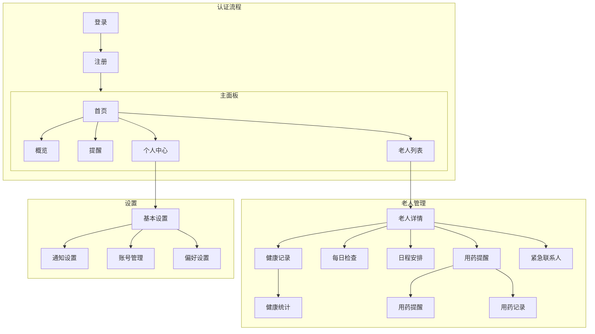

# 老年关怀应用 - 子女端 (Elderly Care App - Caregiver)

基于Flutter开发的老年关怀应用子女端，支持iOS和Android平台。专注于提供完整的老人关怀管理功能。

## 项目结构
```
elderly_care_app_caregiver/
├── lib/
│   ├── main.dart                 # 应用入口
│   ├── config/                   # 配置文件
│   │   ├── theme.dart           # 主题配置
│   │   └── routes.dart          # 路由配置
│   │
│   ├── models/                   # 数据模型
│   │   ├── elderly.dart         # 老人信息模型
│   │   ├── health_record.dart   # 健康记录模型
│   │   ├── daily_check.dart     # 每日检查模型
│   │   └── notification.dart    # 通知模型
│   │
│   ├── screens/                  # 页面
│   │   ├── auth/               # 认证相关页面
│   │   │   ├── login.dart
│   │   │   └── register.dart
│   │   │
│   │   ├── dashboard/          # 主面板相关
│   │   │   ├── home.dart      # 主页
│   │   │   ├── overview.dart  # 概览
│   │   │   └── alerts.dart    # 提醒
│   │   │
│   │   ├── elderly/           # 老人管理
│   │   │   ├── list.dart     # 老人列表
│   │   │   ├── detail.dart   # 详细信息
│   │   │   ├── health.dart   # 健康记录
│   │   │   └── schedule.dart # 日程安排
│   │   │
│   │   └── settings/         # 设置相关
│   │
│   └── widgets/              # 可复用组件
│
└── assets/                   # 资源文件
```

## 页面导航逻辑



## 核心功能

1. **老人管理**
   - 多老人信息管理
   - 健康档案维护
   - 用药提醒设置
   - 日程安排管理

2. **健康监测**
   - 每日健康数据记录
   - 异常情况提醒
   - 健康趋势分析
   - 定期体检提醒

3. **日常关怀**
   - 每日问候记录
   - 生活需求响应
   - 紧急情况处理
   - 回访提醒

4. **数据分析**
   - 健康数据统计
   - 生活规律分析
   - 异常情况统计
   - 关怀质量评估

## 开发规范

1. **UI设计原则**
   - 信息层级清晰
   - 重要信息突出显示
   - 操作流程简化
   - 提供即时反馈

2. **代码规范**
   - 遵循Dart代码规范
   - 使用状态管理（GetX/Provider）
   - 实现错误处理
   - 添加日志记录

## 开发计划

1. **第一阶段 (基础功能)**
   - [x] 用户认证系统
   - [ ] 老人信息管理
   - [ ] 基础健康记录
   - [ ] 消息通知

2. **第二阶段 (核心功能)**
   - [ ] 健康数据分析
   - [ ] 异常预警系统
   - [ ] 用药提醒
   - [ ] 日程管理

3. **第三阶段 (高级功能)**
   - [ ] 数据可视化
   - [ ] 智能分析
   - [ ] 多设备同步
   - [ ] 导出报告

## API集成

基础API端点：
```dart
class ApiEndpoints {
  static const String BASE_URL = 'api.elderlycare.com/v1';
  static const String ELDERLY = '/elderly';
  static const String HEALTH = '/health';
  static const String DAILY_CHECK = '/daily-check';
  static const String NOTIFICATION = '/notification';
}
```

## 状态管理示例

```dart
class ElderlyController extends GetxController {
  final elderly = <Elderly>[].obs;
  final isLoading = false.obs;

  Future<void> fetchElderly() async {
    isLoading.value = true;
    try {
      final response = await api.getElderly();
      elderly.value = response;
    } finally {
      isLoading.value = false;
    }
  }
}
```

## 贡献指南

遵循标准Git工作流程，提交前确保：
1. 代码已格式化
2. 测试通过
3. 遵循命名规范
4. 更新文档


## 命名规范

为确保代码质量和可维护性，请严格遵循以下命名规范：

### 1. 文件命名
```
lib/
├── screens/
│   ├── home_screen.dart     // ✅ 正确：小写+下划线
│   ├── HomeScreen.dart      // ❌ 错误：使用大写
│   └── home-screen.dart     // ❌ 错误：使用连字符
```

### 2. 类命名（大驼峰）
```dart
// ✅ 正确示例
class ElderlyDetailScreen extends StatelessWidget { }
class HealthRecordCard extends StatelessWidget { }
class UserController extends GetxController { }

// ❌ 错误示例
class elderlyDetailScreen extends StatelessWidget { }  // 首字母小写
class health_record_card extends StatelessWidget { }   // 使用下划线
```

### 3. 变量和方法命名（小驼峰）
```dart
// ✅ 正确示例
String userName;
void updateHealthRecord() { }
Future<void> fetchElderlyData() async { }

// ❌ 错误示例
String UserName;         // 首字母大写
void Update_Record() { } // 使用下划线
```

### 4. 常量命名（全大写+下划线）
```dart
// ✅ 正确示例
const double MAX_AGE = 120;
const String API_BASE_URL = 'https://api.example.com';

// ❌ 错误示例
const double maxAge = 120;        // 使用驼峰
const String ApiBaseUrl = '...';  // 使用大驼峰
```

### 5. 私有成员命名
```dart
class HealthRecord {
  // ✅ 正确示例
  String _privateData;
  void _updateInternalState() { }

  // ❌ 错误示例
  String private_data;  // 使用下划线分隔
  void privateMethod() { }  // 缺少下划线前缀
}
```

### 6. 布尔变量命名
```dart
// ✅ 正确示例
bool isLoading = false;
bool hasError = false;
bool canProceed = true;

// ❌ 错误示例
bool loading = false;   // 不够明确
bool error = false;     // 不够明确
bool proceed = true;    // 不够明确
```

### 7. Widget相关命名
```dart
// ✅ 正确示例
class CustomButton extends StatelessWidget {
  final VoidCallback onPressed;
  final String buttonText;
  
  // ...
}

// ❌ 错误示例
class custom_button extends StatelessWidget {  // 使用下划线
  final VoidCallback OnPress;  // 大写开头
  final String BtnText;       // 使用缩写
}
```

### 常见错误避免
1. **避免缩写**
   ```dart
   // ✅ 正确示例
   String userIdentification;
   String buttonText;
   
   // ❌ 错误示例
   String userId;  // 除非是普遍接受的缩写
   String btnTxt;  // 不必要的缩写
   ```

2. **避免无意义的名称**
   ```dart
   // ✅ 正确示例
   List<Elderly> elderlyList;
   void updateHealthRecord() { }
   
   // ❌ 错误示例
   List<Elderly> list1;
   void doSomething() { }
   ```

遵循这些命名规范能够：
- 提高代码可读性
- 减少团队沟通成本
- 降低维护难度
- 避免常见错误

建议在IDE中配置代码格式化规则，帮助自动遵循这些规范。


## 许可证

MIT License