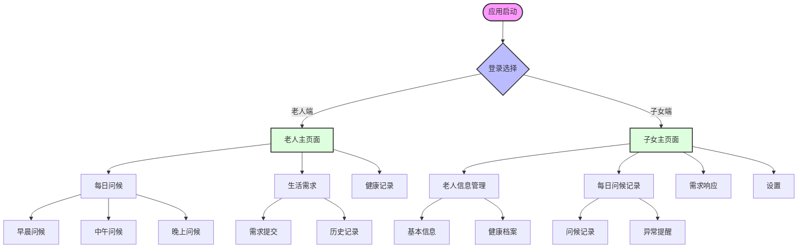

# 老年关怀应用 (Elderly Care App)

一个基于Flutter开发的老年关怀应用，支持iOS和Android平台。该应用包含老人端和子女端两个主要界面，旨在提供简单的交互体验和信息记录功能。

## 项目结构

```
elderly_care_app/
├── lib/
│   ├── main.dart                 # 应用入口
│   ├── config/                   # 配置文件
│   │   ├── theme.dart           # 主题配置
│   │   └── routes.dart          # 路由配置
│   │
│   ├── models/                   # 数据模型
│   │   ├── elderly_user.dart    # 老人用户模型
│   │   ├── caregiver_user.dart  # 子女用户模型
│   │   └── daily_record.dart    # 日常记录模型
│   │
│   ├── screens/                  # 页面
│   │   ├── elderly/             # 老人端界面
│   │   │   ├── home_screen.dart
│   │   │   ├── chat_screen.dart
│   │   │   └── daily_check_screen.dart
│   │   │
│   │   └── caregiver/           # 子女端界面
│   │       ├── dashboard_screen.dart
│   │       ├── elderly_info_screen.dart
│   │       └── settings_screen.dart
│   │
│   ├── widgets/                  # 可复用组件
│   │   ├── common/              # 通用组件
│   │   ├── elderly/             # 老人端组件
│   │   └── caregiver/           # 子女端组件
│   │
│   ├── services/                 # 服务层
│   └── utils/                    # 工具类
│
└── assets/                       # 资源文件
    ├── images/
    └── icons/
```

## 页面导航逻辑

以下是应用的主要页面导航流程：




## 页面说明

### 老人端

1. **主页面 (ElderlyHomeScreen)**
   - 大字体简单按钮导航
   - 显示当前时间和日期
   - 快速进入各功能模块

2. **每日问候 (DailyCheckScreen)**
   - 早晨问候（7:30）
   - 中午问候（12:30）
   - 晚上问候（20:30）
   - 每个时段显示固定的问候语和简单选项

3. **生活需求 (NeedsScreen)**
   - 大图标表示各类需求
   - 简单的确认机制
   - 需求提交后自动通知子女端

### 子女端

1. **主页面 (CaregiverDashboardScreen)**
   - 老人状态概览
   - 最新需求提醒
   - 每日问候完成情况

2. **老人信息管理 (ElderlyInfoScreen)**
   - 基本信息维护
   - 健康档案管理
   - 用药提醒设置

3. **设置页面 (SettingsScreen)**
   - 消息通知设置
   - 个人信息维护
   - 应用相关设置

## 路由管理

使用命名路由进行页面导航。主要路由定义如下：

```dart
// routes.dart
final Map<String, WidgetBuilder> routes = {
  '/': (context) => LoginScreen(),
  '/elderly/home': (context) => ElderlyHomeScreen(),
  '/elderly/daily-check': (context) => DailyCheckScreen(),
  '/elderly/needs': (context) => NeedsScreen(),
  '/caregiver/dashboard': (context) => CaregiverDashboardScreen(),
  '/caregiver/elderly-info': (context) => ElderlyInfoScreen(),
  '/caregiver/settings': (context) => SettingsScreen(),
};
```

页面跳转示例：

```dart
// 普通跳转
Navigator.pushNamed(context, '/elderly/home');

// 替换当前页面
Navigator.pushReplacementNamed(context, '/elderly/home');

// 返回到特定页面
Navigator.pushNamedAndRemoveUntil(
  context,
  '/elderly/home',
  (route) => false,
);
```

## 开发指南

1. **新增页面流程**
   - 在screens目录下创建新的页面文件
   - 在routes.dart中添加路由配置
   - 更新相关页面的导航逻辑

2. **添加新功能**
   - 评估是否需要创建新的组件
   - 在对应目录下创建组件文件
   - 确保组件可复用性
   - 更新相关文档

3. **代码规范**
   - 使用dart format格式化代码
   - 遵循Flutter官方推荐的代码风格
   - 为复杂的Widget添加注释
   - 使用const构造器提高性能

## 注意事项

1. **老人端设计原则**
   - 使用大字体（至少24号）
   - 按钮间距充足（避免误触）
   - 色彩对比度高
   - 操作步骤简单

2. **子女端设计原则**
   - 信息展示清晰
   - 操作响应及时
   - 重要信息突出显示
   - 提供足够的反馈机制

3. **性能考虑**
   - 使用const构造器
   - 合理使用StatelessWidget
   - 避免不必要的setState
   - 图片资源优化

## 后续开发计划

1. **第一阶段**
   - [x] 项目基础架构搭建
   - [x] 基本页面导航
   - [ ] 老人端核心功能
   - [ ] 子女端基础功能

2. **第二阶段**
   - [ ] 数据持久化
   - [ ] 消息推送
   - [ ] 界面优化
   - [ ] 性能优化

## 贡献指南

1. Fork 项目
2. 创建特性分支
3. 提交变更
4. 推送到分支
5. 创建Pull Request

## 作者

[您的名字]

## 许可证

MIT License


## 命名规范

### 驼峰命名法说明

Flutter/Dart项目中使用两种驼峰命名法：

#### 1. 大驼峰命名法（Pascal Case）
- 所有单词的首字母均大写
- 使用场景：
  - 类名
  - Widget名称
  - 枚举类型
  - 类型定义（typedef）

```dart
// ✅ 正确的大驼峰命名
class UserProfile { }
class ElderlyHomeScreen extends StatelessWidget { }
class CustomButton { }
enum UserType { Admin, Regular }

// ❌ 错误的大驼峰命名
class userProfile { }  // 首字母小写
class elderly_home_screen { }  // 使用下划线
```

#### 2. 小驼峰命名法（Camel Case）
- 第一个单词首字母小写，其后单词首字母大写
- 使用场景：
  - 变量名
  - 方法名
  - 函数参数
  - 实例对象

```dart
// ✅ 正确的小驼峰命名
String userName = 'John';
void getUserInfo() { }
bool isUserLoggedIn = false;

// ❌ 错误的小驼峰命名
String UserName;  // 首字母大写
void get_user_info() { }  // 使用下划线
```

### 文件命名规范

1. **Dart文件命名**
   - 使用小写字母
   - 单词间用下划线连接
   - 文件名应该描述其主要内容

```
✅ 正确的文件命名：
lib/
  ├── screens/
  │   ├── home_screen.dart
  │   ├── user_profile_screen.dart
  │   └── settings_screen.dart
  │
  ├── widgets/
  │   ├── custom_button.dart
  │   └── user_avatar.dart

❌ 错误的文件命名：
homeScreen.dart      // 使用驼峰
UserProfile.dart     // 首字母大写
settings-screen.dart // 使用连字符
```

2. **资源文件命名**
   - 使用小写字母
   - 单词间用下划线连接
   - 添加适当的前缀表示用途

```
assets/
  ├── images/
  │   ├── bg_home.png
  │   ├── icon_user.png
  │   └── logo_main.png
  │
  ├── icons/
  │   ├── ic_settings.svg
  │   ├── ic_profile.svg
  │   └── ic_home.svg
```

### 特殊命名规范

1. **私有成员命名**
   - 以下划线开头
   - 后续遵循小驼峰命名法

```dart
class UserManager {
  // 私有变量
  String _userName;
  int _userAge;
  
  // 私有方法
  void _updateUserData() {
    // 实现代码
  }
}
```

2. **常量命名**
   - 全大写字母
   - 单词间用下划线连接

```dart
// ✅ 正确的常量命名
const double PI_VALUE = 3.14159;
const String API_BASE_URL = 'https://api.example.com';
const int MAX_RETRY_COUNT = 3;

// ❌ 错误的常量命名
const String apiBaseUrl = 'https://api.example.com';  // 使用驼峰
const String API-BASE-URL = 'https://api.example.com';  // 使用连字符
```

3. **Widget属性命名**
   - 使用小驼峰命名法
   - 名称应该清晰表达用途

```dart
class CustomButton extends StatelessWidget {
  final String buttonText;
  final VoidCallback onPressed;
  final double fontSize;
  final Color backgroundColor;
  
  const CustomButton({
    required this.buttonText,
    required this.onPressed,
    this.fontSize = 16.0,
    this.backgroundColor = Colors.blue,
  });
}
```

### 命名建议

1. **使用有意义的名称**
```dart
// ✅ 好的命名
String getUserDisplayName() { }
bool isAuthenticated;
int itemCount;

// ❌ 不好的命名
String getName() { }  // 不够具体
bool flag;  // 不清楚标识什么
int n;  // 不明确用途
```

2. **避免缩写（除非是广泛接受的缩写）**
```dart
// ✅ 好的命名
String userIdentification;
int maximumLength;
bool isEnabled;

// ❌ 不好的命名
String userId;  // 可接受的常用缩写
String usrIdnt;  // 不清晰的缩写
int maxLen;  // 不必要的缩写
```

3. **布尔变量命名**
   - 使用 is、has、can 等前缀

```dart
// ✅ 好的布尔变量命名
bool isLoading;
bool hasError;
bool canProceed;

// ❌ 不好的布尔变量命名
bool loading;  // 不够清晰
bool error;   // 不够明确
bool status;  // 不表达布尔含义
```

遵循这些命名规范可以：
- 提高代码可读性
- 减少命名冲突
- 方便团队协作
- 符合Flutter/Dart社区规范
- 降低维护成本

在开发过程中，建议使用IDE的代码检查工具来帮助遵守这些命名规范。