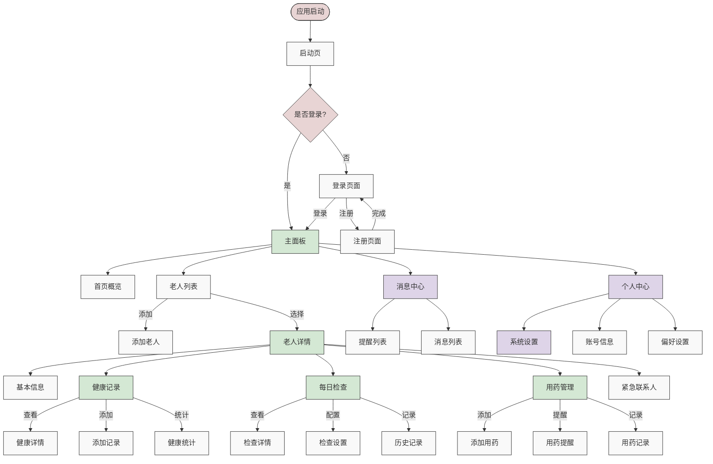

# 子女端的界面跳转逻辑
使用Mermaid图表来表示所有关键页面和交互。



主要页面跳转说明：

1. **认证流程**
```dart
// routes.dart
Map<String, WidgetBuilder> authRoutes = {
  '/splash': (context) => SplashScreen(),
  '/login': (context) => LoginScreen(),
  '/register': (context) => RegisterScreen(),
};
```

2. **主要功能路由**
```dart
// routes.dart
Map<String, WidgetBuilder> mainRoutes = {
  '/dashboard': (context) => DashboardScreen(),
  '/elderly/list': (context) => ElderlyListScreen(),
  '/elderly/detail': (context) => ElderlyDetailScreen(),
  '/elderly/health': (context) => HealthRecordsScreen(),
  '/elderly/medications': (context) => MedicationsScreen(),
  '/elderly/daily-checks': (context) => DailyChecksScreen(),
};
```

3. **关键页面跳转示例**
```dart
class NavigationService {
  // 打开老人详情页
  void openElderlyDetail(BuildContext context, String elderlyId) {
    Navigator.pushNamed(
      context,
      '/elderly/detail',
      arguments: ElderlyDetailArguments(elderlyId),
    );
  }
  
  // 打开健康记录
  void openHealthRecords(BuildContext context, String elderlyId) {
    Navigator.pushNamed(
      context,
      '/elderly/health',
      arguments: HealthRecordsArguments(elderlyId),
    );
  }
  
  // 返回到主面板
  void backToDashboard(BuildContext context) {
    Navigator.pushNamedAndRemoveUntil(
      context,
      '/dashboard',
      (route) => false,
    );
  }
}
```

4. **参数传递模型**
```dart
class ElderlyDetailArguments {
  final String elderlyId;
  ElderlyDetailArguments(this.elderlyId);
}

class HealthRecordsArguments {
  final String elderlyId;
  final DateTime? startDate;
  final DateTime? endDate;
  
  HealthRecordsArguments(
    this.elderlyId, {
    this.startDate,
    this.endDate,
  });
}
```

